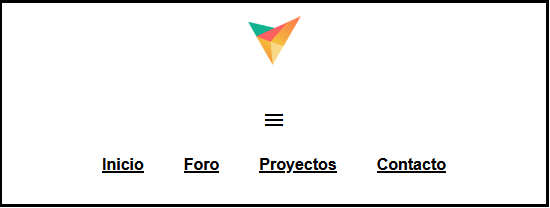

# MenuResponsive

This is a responsive html project, which will change in different technological resolutions.

## Table of contents

- [Description](#description)
- [Technologies](#technologies)
- [Installation](#installation)

## Description

This is a responsive html project, which will change in different technological resolutions. To see the responsive changes, we have to see the desktop, tablet and mobile views.

## Technologies

The project has been created with:

- HTML
- CSS
- JS

## Installation

To run this project, we need the following steps:

- Download the Live Server extension, which is found in the vscode editor

- Once the extension is downloaded, run the extension and everything will work correctly

- If you get an error, try running the application normally using the index.html file
